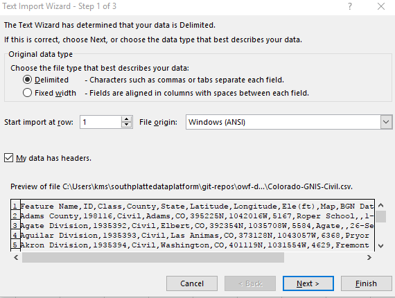
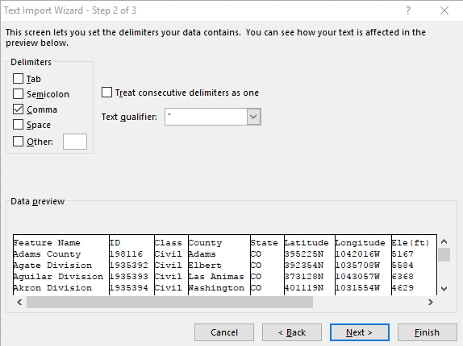
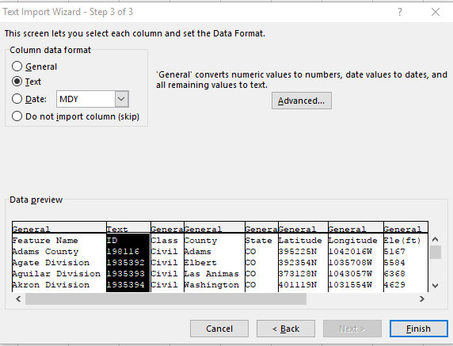

# Learn CSV / CSV with Excel #

Tabular datasets can be maintained as worksheets in an Excel workbook file.
If maintaining in Excel, it is useful to export the data to CSV so that other programs can read and process the data.

A tabular dataset can also be maintained as a CSV files.
if maintaining in CSV, Excel can be used to view and edit the CSV file.

## Reading CSV Files ##

By default, clicking on a CSV file within Windows File Explorer will automatically open the CSV file in Excel,
assuming that Excel is the default application for files with `csv` file extension.

Advantages to directly opening a CSV file in Excel include:

* Excel is able to determine how the file is delimited (comma, tab, pipe, etc.)
and correctly read data into columns and rows.
* Edits to the data can be easily made within Excel.

However, while it may appear convenient to view and work with CSV files in Excel,
there are limitations with directly opening a CSV file into Excel, including:

* Some data types will not be formatted properly.
For example, for numbers that are padded with zeroes, such as identifiers,
Excel will remove the leading zeroes.
Even if the numbers are formatted as text to preserve the leading zeroes (e.g., `"001"`),
Excel will automatically convert the values into numbers and remove leading zeroes.

To preserve data types, the following process can be used:

1. Open a blank Excel workbook.
2. On the Ribbon, choose the ***Data*** tab, then ***From Text*** on the ***Get External Data*** section.
3. Choose the CSV file of interest.
4. A ***Text Import Wizard*** window will open, as shown below: 
 
Choose the ***Delimited*** button.
If the data has headers, check the ***My data has headers.*** option.  Click ***Next***.
5. Step 2 of the import wizard looks like the following: 
 
Choose the type of delimiter for the file.  The data will be previewed in the window.  Click ***Next***.
5. Step 3 of the import wizard looks like the following: 
 
This is the crucial step to ensure that data are formatted properly.
By default, most columns will be formatted as "General".
To change the data format, click on a column (it should be highlighted in black) and choose one of the data formats.
Numbers can be left as ***General***.  For numbers with leading zeroes, choose ***Text***.
This will ensure that the zeroes are preserved.  Click ***Finish***.
6. The data will appear in the main Excel window with the proper formatting.

Any formatting of the worksheet after importing,
such as color-coding of cells or the addition of comments, will display in Excel but cannot be saved in CSV.

## Writing Excel to CSV ##

It is convenient to use Excel as a data management solution in cases where a full database is not yet required,
using Excel files `*.xls` or `*.xlsx`.
In this case, it is also useful to export Excel worksheets as CSV files so that other software
can process the simple CSV format without having to read from complex Excel binary files.

An Excel worksheet can be saved to CSV using ***Save As*** and picking ***CSV (Comma delimited) (*.csv)*** in ***Save as type***.
However, the following issues may need to be dealt with:

* **Text is not exported as expected** - For example, if a number needs to be formatted with leading zeroes (e.g., `"006"`),
the cell must be formatted as text.
However, this must be done by formatting the cell as text first.
Entering the number in the cell, changing the format to text, and then trying to change the text, will not work
(see:  [Microsoft answers](https://answers.microsoft.com/en-us/office/forum/office_2010-excel/a-number-formatted-as-text-is-really-a-number/085bb189-342b-4eed-bc33-2f149c6db244)).
